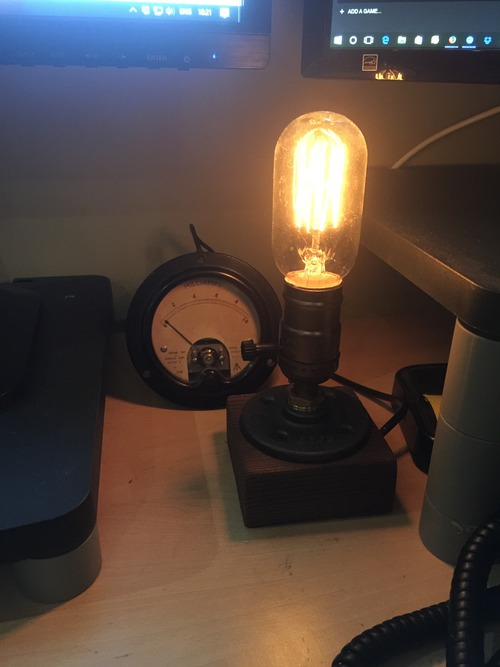

[Back to programming](../index.html)

My boss, Steve, likes [steampunk](https://en.wikipedia.org/wiki/Steampunk). He also liked the display we used to have to monitor what was going on with our servers. So, for Christmas I decided to make him an old-fashioned dial display that shows the current load on our servers. It uses the local WiFi to connect to [AWS Lambda](https://aws.amazon.com/lambda/) to get the current value of the relevant [CloudWatch metric](https://aws.amazon.com/cloudwatch/), in our case requests/minute to our main servers.

<figure>
  
  <figcaption>The load meter on Steve's desk behind his lamp. Boxing day, so not much load.</figcaption>
</figure>

<figure>
  
  <figcaption>This is the meter, showing 3600 requests/minute to our main servers.  The black cable provides power. Data is over wifi.</figcaption>
</figure>

The display is an unmodified 1mA ammeter built in 1949. I got it from [ElectroJumble](http://www.electrojumble.org/Meters.htm).

<figure>
  
  <figcaption>This is the wiring, showing a WEMOS D1 Mini wired to the ammeter inputs   in series with a variable resistor. The black cable is power. The gold looking  zig-zag is the aerial. The mess on the top of the left peg is masking tape.</figcaption>
</figure>

The brains is an [ESP-8266EX](https://espressif.com/en/products/hardware/esp8266ex/overview) in the form of a [WEMOS D1 Mini](https://www.wemos.cc/product/d1-mini.html).

The wiring is simple, and doesn't require altering the ammeter:

1. The WEMOS is powered using a USB cable (black cable from the bottom).
2. The ground pin of the WEMOS is wired to the ground pin of the ammeter.
3. The D0 pin of the WEMOS is wired to a variable potentiometer which is then wired to the positive pin of the ammeter.

The code is in two parts.

The ESP-8266:

1. Boots up
2. Connects to the local wifi
3. Makes a request to a url on our servers (see below) that returns a single value between 0 and 1000
4. Sets PIN D0 to a voltage based on that value (this is done using the ESP-8266's ability to do [PWM](https://en.wikipedia.org/wiki/Pulse-width_modulation))
5. The voltage causes a current to flow through the variable resistor, which is then measured by the ammeter.
6. The ESP-8266 then sleeps for a minute, before repeating the process.

The API:

1. Uses [Amazon's API gateway](https://aws.amazon.com/api-gateway/), which provides an https url.
2. When the ESP-8266 makes a GET request to that url, it is passed onto an AWS lambda function.
3. The Lambda function gets the latest value of a CloudWatch metric,
4. scales that value to be between 0 and 1000
5. returns that value to the API gateway, which
6. returns the value as the solitary content of the response body

The display is calibrated by adjusting the potentiometer.

My code is available on [github](https://gist.github.com/tamc/22a25788480b71102bcb297d01934bf5) and reproduced below.

You can [contact me](mailto:tom@counsell.org) if you have any questions.

